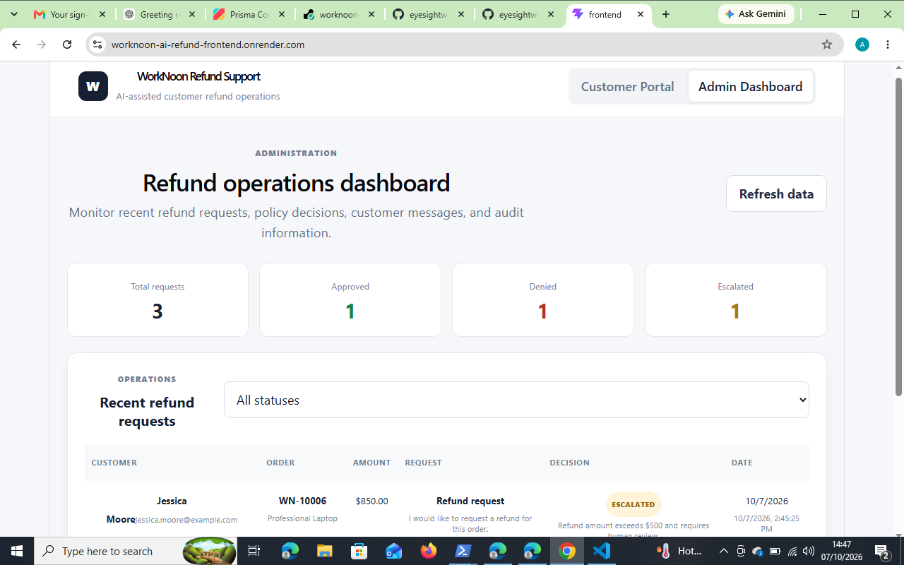

# WorkNoon AI Refund Support System

A production-minded full-stack AI-assisted refund support system built for the WorkNoon Full Stack AI Integration Product Challenge.

The system accepts customer refund requests, evaluates them against deterministic business rules, generates customer-facing responses with OpenAI when available, and provides an admin dashboard for reviewing refund outcomes and audit information.

## Live Demo

**Frontend:** https://worknoon-ai-refund-frontend.onrender.com

**Backend:** https://worknoon-ai-refund-system.onrender.com

**GitHub:** https://github.com/eyesightworks/worknoon-ai-refund-system



---

## Features

* Customer refund request portal
* Synthetic customer and order data
* Deterministic refund policy engine
* `APPROVED` / `DENIED` / `ESCALATED` outcomes
* High-value refund escalation
* Final-sale protection
* Refund age validation
* Damaged/incorrect-item handling
* Suspicious or conflicting request detection
* Prompt-injection detection
* OpenAI-assisted customer response generation
* Deterministic fallback when AI is unavailable
* Admin dashboard with refund request history
* Audit logging
* PostgreSQL database with Prisma ORM
* REST API built with NestJS
* React/Vite frontend
* Production deployment on Render

---

## Architecture

```text
Customer
   │
   ▼
React + Vite Frontend
   │
   │ REST API
   ▼
NestJS Backend
   │
   ├── Refund Policy Engine
   │      ├── Final-sale validation
   │      ├── Refund age validation
   │      ├── Amount escalation
   │      ├── Damaged/incorrect-item handling
   │      └── Suspicious request detection
   │
   ├── OpenAI Integration
   │      └── Customer-facing response generation
   │
   ├── Audit Logging
   │
   ▼
Prisma ORM
   │
   ▼
PostgreSQL
```

The production application is deployed using Render, with the frontend and backend deployed as separate services.

---

## Refund Policy

The policy engine evaluates requests in the following order:

1. **Final-sale items** → `DENIED`
2. **Suspicious or conflicting requests** → `ESCALATED`
3. **Orders older than 30 days** → `DENIED`
4. **Refunds above $500** → `ESCALATED` for human review
5. **Damaged or incorrect items** → `APPROVED`
6. **Other eligible requests** → `APPROVED`

The policy engine is deterministic. AI does not make the final refund decision and cannot override the business rules.

The decision source is recorded as `POLICY`.

---

## AI Integration

The backend includes an OpenAI integration for generating customer-facing refund responses.

AI is intentionally separated from the core refund decision logic:

* Business rules determine the refund outcome.
* OpenAI is used to assist with the customer-facing response.
* If the AI provider is unavailable or the configured API quota is exhausted, the system uses a deterministic fallback response.
* The refund decision remains available even when AI generation is unavailable.

This keeps the core business process predictable and prevents an AI response from overriding refund policy.

---

## Example Outcomes

The deployed application has been tested with different policy scenarios:

| Order      | Scenario                 | Result      |
| ---------- | ------------------------ | ----------- |
| `WN-10001` | Standard eligible refund | `APPROVED`  |
| `WN-10002` | Final-sale item          | `DENIED`    |
| `WN-10006` | Refund above $500        | `ESCALATED` |

The admin dashboard records these requests and displays the resulting status and decision information.

---

## Tech Stack

### Frontend

* React
* TypeScript
* Vite

### Backend

* Node.js
* NestJS
* TypeScript
* REST API

### Database

* PostgreSQL
* Prisma ORM

### AI

* OpenAI API

### Deployment

* Render

### Development

* Git / GitHub
* npm
* Docker Compose

---

## Project Structure

```text
worknoon-ai-refund-system/
│
├── backend/
│   ├── prisma/
│   │   ├── migrations/
│   │   └── seed.ts
│   └── src/
│       ├── refund/
│       ├── prisma/
│       └── ...
│
├── frontend/
│   └── src/
│
├── docker-compose.yml
└── README.md
```

---

## Running Locally

### Backend

```bash
cd backend
npm install
npx prisma generate
npx prisma migrate dev
npm run start:dev
```

The backend runs on:

```text
http://localhost:3000
```

### Frontend

```bash
cd frontend
npm install
npm run dev
```

The frontend runs on:

```text
http://localhost:5173
```

---

## Environment Variables

### Backend

Create a `.env` file in the `backend` directory:

```env
DATABASE_URL=your_postgresql_connection_string
OPENAI_API_KEY=your_openai_api_key
```

### Frontend

Create a `.env` file in the `frontend` directory:

```env
VITE_API_URL=http://localhost:3000
```

Never commit real API keys or database credentials to source control.

---

## API

The backend exposes REST endpoints for:

* Retrieving available orders
* Creating refund requests
* Processing refund decisions
* Retrieving refund request history

The refund workflow records the decision, decision source, reasoning, AI response, and audit information.

---

## Production Deployment

The application is deployed as two services:

```text
Render Static Site
        │
        ▼
React / Vite Frontend
        │
        │ HTTPS REST API
        ▼
Render Web Service
        │
        ▼
NestJS Backend
        │
        ▼
Prisma
        │
        ▼
PostgreSQL
```

The production frontend is configured to communicate with the deployed backend through the `VITE_API_URL` environment variable.

---

## Design Decisions

### Deterministic Business Rules

Refund decisions are handled by explicit business rules rather than relying on an LLM. This makes the system predictable, testable, and easier to audit.

### AI as an Assistant

AI is used for customer communication rather than making authoritative business decisions.

### Auditability

Refund requests store decision information and audit events so administrators can review what happened during the refund workflow.

### Graceful AI Failure

The application remains functional when the AI provider is unavailable. A deterministic fallback response is returned instead.

---

## Disclaimer

This project uses synthetic customer and order data and was developed as a technical demonstration for the WorkNoon Full Stack AI Integration Product Challenge.
